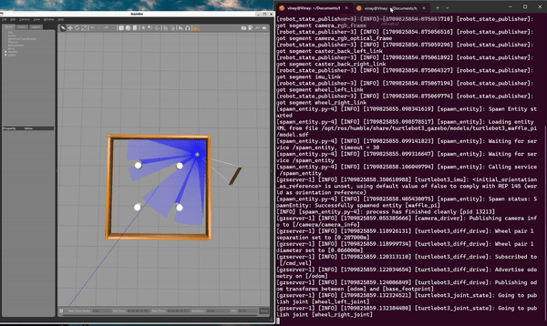

# Overview

The repository contains the procedure to execute an obstacle avoidance algorithm using ROS2 Humble with help of a turtlebot. The turtlebot navigates freely avoiding obstacles in simulation environment Gazebo by using the LIDAR sensor. Using the data received from the LIDAR sensor, the robot takes the next step whether to move forward or rotate to avoid the obstacle infront. Furthermore, this can be integrated to include start and goal node and make it follow along a path avoiding obstacles.

To execute the algorithm, follow the steps below. The initial method involves running the algorithm within a Docker image. By employing this method, the Docker image can be executed on any Ubuntu/Windows system, ensuring scalability and efficiency.

## Appoach 1 : USING DOCKER

1. Make sure Docker is installed on your system.
2. The execution requires rocker, which can be installed using below command. If you faces issues installing rocker with below command refer to this documentation -> [Rocker](https://github.com/osrf/rocker)
```
sudo apt install python3-rocker
```
3. Clone the repository using the command below. Use terminal in Ubuntu or Git Bash Terminal in Windows
```
git clone https://github.com/vinay06vinay/Turtlebot3-Obstacle-Avoidance-ROS2.git
```
4. In the terminal make sure you are in the directory of the cloned package.
```
cd Turtlebot3-Obstacle-Avoidance-ROS2
```
5. Build the docker image using below command in terminal 
```
# This command uses the docker file in your directory and builds an image with name turtlebot3_container
docker build . -t turtlebot3_container
```
6. Once the docker image is built, check the image by using below command
```
docker images
```
7. Use the below rocker command to run the docker container. It will open a terminator window with the ros package built
```
rocker --x11 --privileged turtlebot3_container terminator
```
8. The commands below should be run inside terminator window opened to execute the obstacle avoidance algorithm
```bash
    #Just make sure the current workspace is turtlebot3_ws and source your workspace
    source install/setup.bash
    # Run below command for obstacle avoidance algorithm
    ros2 launch obstacle_avoidance_tb3 launch.py
    # In another terminal of terminator (opened by right click -> split horizontally/verticall)
    ros2 topic echo /scan # this displays the LIDAR sensor reading printed on console 
```
9. To run the teleop functionality, run below commands in the terminator window opened by running our container in previous step
```bash
    # In terminal 1
    ros2 launch turtlebot3_gazebo turtlebot3_dqn_stage2.launch.py
    # In terminal 2
    ros2 run obstacle_avoidance_tb3 turtlebot_teleop.py
```
10. Use the keyboard keys shown on the terminal to operate the turtlebot3 in Gazebo Environment.

## Approach 2: Using Ubuntu 22 and ROS2 Humble

1. Move to the source directory of your ROS workspace. Also make sure you source into ROS humble and have Ubuntu 22 OS
```bash
    source /opt/ros/humble/setup.bash
    export TURTLEBOT3_MODEL=waffle_pi
    cd ros2_ws/src
```
2. Clone the repository using the command below. Use terminal in Ubuntu 
```bash
    git clone https://github.com/vinay06vinay/Turtlebot3-Obstacle-Avoidance-ROS2.git
    cd ..
```
3. Run below commands to perform teleoperation
```bash
    # Terminal 1
    colcon build --packages-select obstacle_avoidance_tb3
    source install/setup.bash
    ros2 launch turtlebot3_gazebo turtlebot3_dqn_stage2.launch.py
    # Terminal 2
    source /opt/ros/humble/setup.bash
    source install/setup.bash
    ros2 run obstacle_avoidance_tb3 turtlebot_teleop.py
```
4. Run below commands to execute obstacle Avoidance algorithm
```bash
    # Terminal 1
    colcon build --packages-select obstacle_avoidance_tb3
    source install/setup.bash
    ros2 launch obstacle_avoidance_tb3 launch.py
```

## Results

All the result videos can be found in the result folder of the cloned directory.

<p align="center">

</p>


## References
1.  Gazebo Simulation Tutorials - https://emanual.robotis.com/docs/en/platform/turtlebot3/simulation/
2.  Python3 rocker - https://github.com/osrf/rocker
3.  Turtlebot3 teleop - https://github.com/ROBOTIS-GIT/turtlebot3/tree/humble-devel/turtlebot3_teleop