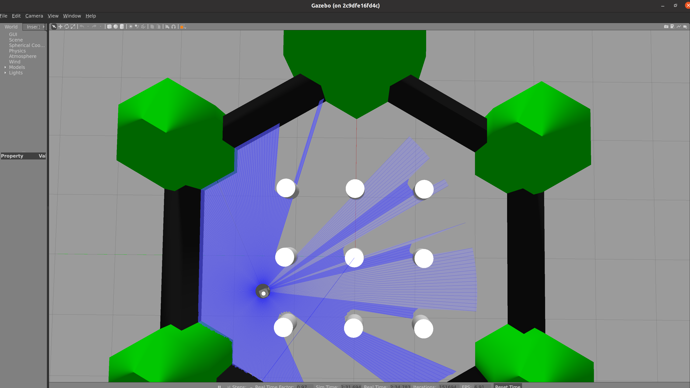

# TurtleBot3 Walker ROS 2
A Tutorial showing turtlebot navigating in a Gazebo environment avoiding obstacles.

### Building the ROS package
```bash
# Source to ros humble
source /opt/ros/humble/setup.bash
# Go to the source directory of your ros2 workspace
cd ~/ros2_ws/src
git clone https://github.com/vinay06vinay/turtlebot3_walker_ros2.git

# Once files are checked, go back to the root directory of ros workspace
cd ..
# Install rosdep dependencies before building the package
rosdep install -i --from-path src --rosdistro humble -y
# Build the package using colcon build
colcon build --packages-select turtlebot3_walker_ros2
# After successfull build source the package
. install/setup.bash
```

**Run below commands to Run the Turtlebot without recording a rosbag**
```bash
# Using launch file to run publisher to launch the turtlebot on twist topic
ros2 launch turtlebot3_walker_ros2 launch.py
```

**Run below commands to check the functionality of the Rosbag while the turtlebot is running**
```bash
# Using launch file to run publisher to launch the turtlebot on twist topic
ros2 launch turtlebot3_walker_ros2 launch.py record_topics:=True

# Press Ctrl+C after 15 seconds

# To view the rosbag info. Be in the current directory only
ros2 bag info walker_bag_topics_list
# To play the rosbag. Check the rosbag file name [Terminal 2]
cd walker_bag_topics_list
ros2 bag play ["ros bag file name"]
```

### Results for Gazebo Run

<p align="center">

</p>

### Results for ROS2 Bag Info
```
Files:             walker_bag_topics_list/walker_bag_topics_list_0.db3
Bag size:          6.6 MiB
Storage id:        sqlite3
Duration:          50.696s
Start:             Nov 29 2023 14:27:34.415 (1701286054.415)
End:               Nov 29 2023 14:28:25.111 (1701286105.111)
Messages:          16500
Topic information: Topic: /clock | Type: rosgraph_msgs/msg/Clock | Count: 498 | Serialization Format: cdr
                   Topic: /cmd_vel | Type: geometry_msgs/msg/Twist | Count: 244 | Serialization Format: cdr
                   Topic: /imu | Type: sensor_msgs/msg/Imu | Count: 9857 | Serialization Format: cdr
                   Topic: /joint_states | Type: sensor_msgs/msg/JointState | Count: 1451 | Serialization Format: cdr
                   Topic: /odom | Type: nav_msgs/msg/Odometry | Count: 1453 | Serialization Format: cdr
                   Topic: /parameter_events | Type: rcl_interfaces/msg/ParameterEvent | Count: 48 | Serialization Format: cdr
                   Topic: /performance_metrics | Type: gazebo_msgs/msg/PerformanceMetrics | Count: 251 | Serialization Format: cdr
                   Topic: /robot_description | Type: std_msgs/msg/String | Count: 1 | Serialization Format: cdr
                   Topic: /rosout | Type: rcl_interfaces/msg/Log | Count: 37 | Serialization Format: cdr
                   Topic: /scan | Type: sensor_msgs/msg/LaserScan | Count: 247 | Serialization Format: cdr
                   Topic: /tf | Type: tf2_msgs/msg/TFMessage | Count: 2412 | Serialization Format: cdr
                   Topic: /tf_static | Type: tf2_msgs/msg/TFMessage | Count: 1 | Serialization Format: cdr
```

### CppCheck & CppLint
```bash
# Use the below command for cpp check by moving to directory beginner_tutorials
cppcheck --enable=all --std=c++17 --suppress=missingIncludeSystem $( find . -name *.cpp | grep -vE -e "^(./build/|./install/|./log/)" ) --check-config  &> results/cppcheck.txt

# Use the below command for cpp lint by moving to directory beginner_tutorials 
cpplint  --filter=-build/c++11,+build/c++17,-build/namespaces,-build/include_order $( find . -name *.cpp | grep -vE -e "^(./build/|./install/|./log/)" ) &> results/cpplint.txt 

## The results of both are present in results folder insider beginner_tutorials directory
```